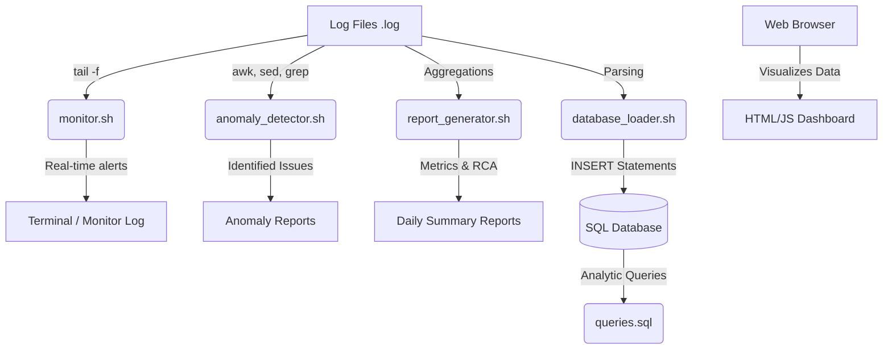

# Unix-Based Log Monitoring Tool

A complete Linux-based log monitoring and analysis system designed to automatically scan application logs, detect anomalies, generate reports, and assist in root cause analysis (RCA) within a Production/Application Support environment.

## 🚀 Features

- **Real-Time Monitoring**: Uses `tail` and `grep` to continuously watch logs for critical failures.
- **Log Parsing & Analysis**: Utilizes `awk` and `sed` to extract insights, format entries, and calculate occurrence statistics.
- **Automated Reporting**: Generates daily text-based summaries of system health and incidents.
- **SQL Database Integration**: Parses anomalies and generates SQL `INSERT` statements to track issues in MySQL/PostgreSQL.
- **Root Cause Analysis (RCA)**: Automatically detects common outage signatures (e.g., OOM, Deadlocks, Gateway Timeouts) and suggests actionable resolutions.
- **Interactive Dashboard**: A sleek, dark-themed HTML/JS dashboard using Chart.js to visualize error trends and system health.

---

## 📂 Project Structure

```text
UnixLogMonitoringTool/
├── logs/                      # Sample production log files
│   ├── application.log
│   ├── database.log
│   └── transaction.log
├── scripts/                   # Core Bash scripts
│   ├── monitor.sh             # Real-time tail -f monitor
│   ├── anomaly_detector.sh    # awk/sed log analyzer
│   ├── report_generator.sh    # Daily metrics and RCA generator
│   └── database_loader.sh     # SQL INSERT statement generator
├── reports/                   # Generated text reports and monitor output
├── sql/                       # Database integration
│   ├── schema.sql             # Table definitions
│   └── queries.sql            # Useful analytical queries
├── dashboard/                 # Web UI visualization
│   ├── index.html
│   ├── style.css
│   └── script.js
└── README.md                  # This file
```

---

## 🛠️ Technology Stack

- **OS**: Linux / Unix (WSL / Git Bash for Windows)
- **Scripting**: Bash Shell, `awk`, `sed`, `grep`
- **Database**: MySQL / PostgreSQL
- **Automation**: Cron Jobs
- **Frontend**: HTML5, CSS3, JavaScript (Chart.js)

---

## 🏗️ Architecture Diagram



---

## ⚙️ Setup & Execution

### 1. Prerequisites
- A Unix-like environment (Linux, MacOS, WSL, or Git Bash).
- (Optional) MySQL or PostgreSQL installed locally for the database component.

### 2. Running the Scripts
Navigate to the project root and make the scripts executable:
```bash
cd scripts/
chmod +x *.sh
```

**Run Real-time Monitor:**
```bash
./monitor.sh
```

**Run Anomaly Detection:**
```bash
./anomaly_detector.sh
```

**Generate Daily Report:**
```bash
./report_generator.sh
```
Check the `reports/` folder for the generated `.txt` files.

### 3. Database Integration
1. Review `sql/schema.sql` and run it against your local database to create the schema.
2. Run the loader script to generate SQL inserts:
```bash
./database_loader.sh
```
3. Load the generated file `sql/load_data.sql` into your database.

### 4. Viewing the Dashboard
Simply open `dashboard/index.html` in any modern web browser to view the interactive UI. No local server is strictly required, though using VS Code Live Server is recommended.

### 5. Cron Job Automation
To automate these tasks, add the following to your crontab (`crontab -e`):
```cron
# Run anomaly detector every hour
0 * * * * cd /path/to/project/scripts && ./anomaly_detector.sh

# Generate daily report at 11:50 PM
50 23 * * * cd /path/to/project/scripts && ./report_generator.sh
```

---

## 📝 Resume / Interview Prep

### Resume-Ready Project Description
> **Production Support Automation Engine**
> Developed a Unix-Based Log Monitoring Tool using Bash scripting, `grep`, `awk`, `sed`, and Cron Jobs to automate log analysis and incident monitoring. Implemented error detection, anomaly identification, report generation, and root cause analysis workflows. Integrated SQL-based validation and automated monitoring processes to support production operations and troubleshooting activities, significantly reducing mean time to resolution (MTTR). Designed an interactive web dashboard for real-time observability.

### Interview Explanation Points
- **Why Bash/Unix?** "I wanted to build a lightweight, dependency-free solution that can run on any standard Linux server directly where the logs reside, without installing heavy agents."
- **Why awk/sed?** "`awk` is incredibly powerful for columnar log parsing and aggregations, while `sed` allows for rapid string manipulation and formatting before piping data to reports or the database."
- **What is the RCA Module?** "Instead of just saying 'there is an error', I programmed the scripts to look for specific signatures (like 'OutOfMemoryError' or 'Database Connection Timeout') and map them to actionable advice for L1/L2 support teams."
- **Database Strategy**: "By converting raw logs into structured SQL data, it enables complex querying over time—like finding the most frequent failure over the last month or identifying specific affected user transactions."