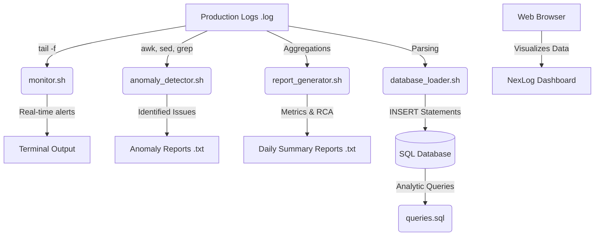

# 🛰️ NexLog Pro: Unix-Based Log Monitoring & RCA Automation Tool


A complete end-to-end Linux/Unix-based log monitoring and analysis system. Designed to automatically scan application logs, detect anomalies, generate reports, and assist in **Root Cause Analysis (RCA)** within a Production/Application Support environment.

## 📋 Table of Contents
1. [Features](#-features)
2. [Project Architecture](#-project-architecture)
3. [Deep Dive: How It Works](#-deep-dive-how-it-works)
4. [Project Structure](#-project-structure)
5. [Setup & Execution](#-setup--execution)
6. [Future Enhancements](#-future-enhancements)

---

## 🚀 Features

- **Real-Time Monitoring**: Uses `tail -f` and `grep` to continuously watch live logs for critical failures.
- **Log Parsing & Analysis**: Utilizes `awk` and `sed` to extract insights, format entries, and calculate occurrence statistics.
- **Automated Reporting**: Generates daily text-based summaries of system health and incidents.
- **SQL Database Integration**: Parses anomalies and generates SQL `INSERT` statements to track issues in MySQL/PostgreSQL.
- **Root Cause Analysis (RCA)**: Automatically detects common outage signatures (e.g., OOM, Deadlocks, Gateway Timeouts) and suggests actionable resolutions.
- **Interactive Dashboard**: A sleek, dark-themed HTML/JS dashboard using Chart.js to visualize error trends and system health, with a built-in Text Report exporter.

---

## 🏗️ Project Architecture



---

## 🧠 Deep Dive: How It Works

This tool is built using standard Linux commands. Here is a simple breakdown of how it works:

1. **Finding Errors (`grep`)**: Imagine `grep` as a very fast search engine. It scans thousands of lines of text to find bad words like `ERROR`, `CRITICAL`, or `TIMEOUT`.
2. **Reading the Data (`awk`)**: Once an error is found, `awk` reads the text line by line. It can easily pick out the date, the time, and the exact error message, and count how many times it happened.
3. **Cleaning the Text (`sed`)**: Sometimes log files have messy or extra characters. `sed` acts like a "Find and Replace" tool to clean up the text so it looks nice in our reports.
4. **Automation (Cron Jobs)**: Instead of clicking a button every day, Cron Jobs act like an alarm clock. They tell the computer to run our scripts automatically in the background (for example, every night at midnight).

---

## 📂 Project Structure

```text
UnixLogMonitoringTool/
├── logs/                      # Sample production log files
│   ├── application.log
│   ├── database.log
│   └── transaction.log
├── scripts/                   # Core Bash scripts
│   ├── monitor.sh             # Real-time tail -f monitor
│   ├── anomaly_detector.sh    # awk/sed log analyzer
│   ├── report_generator.sh    # Daily metrics and RCA generator
│   └── database_loader.sh     # SQL INSERT statement generator
├── reports/                   # Generated text reports and monitor output
├── sql/                       # Database integration
│   ├── schema.sql             # Table definitions
│   ├── load_data.sql          # Auto-generated insert statements
│   └── queries.sql            # Useful analytical queries
├── dashboard/                 # Web UI visualization
│   ├── index.html
│   ├── style.css
│   └── script.js
└── README.md                  # This documentation file
```

---

## ⚙️ Setup & Execution

### 1. Prerequisites
- A Unix-like environment (Linux, MacOS, WSL, or Git Bash on Windows).
- (Optional) MySQL or PostgreSQL installed locally for the database component.

### 2. Running the Scripts

**For Windows Users:**
You must use **Git Bash** to run these shell scripts. Open your project in Git Bash, or open the terminal in VS Code and change the default profile to "Git Bash".

Navigate to the scripts directory:
```bash
cd scripts/
```

**Run Real-time Monitor:**
```bash
bash monitor.sh
```

**Run Anomaly Detection:**
```bash
bash anomaly_detector.sh
```

**Generate Daily Report:**
```bash
bash report_generator.sh
```

**Generate SQL Inserts:**
```bash
bash database_loader.sh
```

*(Note for Linux/Mac users: You can run them directly using `./monitor.sh` after making them executable with `chmod +x *.sh`)*

### 3. Database Integration
1. Review `sql/schema.sql` and run it against your local database to create the schema.
2. Run `./database_loader.sh` to generate SQL inserts inside `sql/load_data.sql`.
3. Load the data into MySQL:
```bash
mysql -u <username> -p < ../sql/load_data.sql
```

### 4. Viewing the Dashboard
Simply open `dashboard/index.html` in any modern web browser to view the interactive UI. Click the **"Export Report"** button to download a generated `.txt` summary of the dashboard metrics.


---

## 🔮 Future Enhancements
- **Webhook Alerting**: Integrate `curl` commands into the bash scripts to send Slack/Discord messages when a `[CRITICAL]` error is parsed.
- **Log Rotation**: Add an archiving script that uses `tar.gz` to compress log files older than 7 days to save disk space.
- **Dynamic Backend**: Replace the static mock JS data with a lightweight Node.js/Python backend that fetches live data directly from the MySQL database.